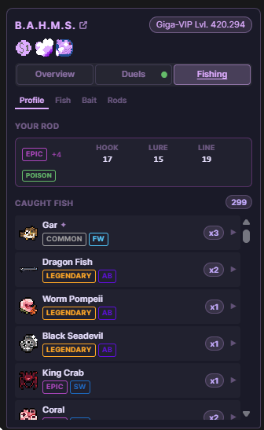

import {Aside, LinkButton, Steps} from "@astrojs/starlight/components";
import BadgeOverview from "../components/BadgeOverview.astro";

Want to view usercards but can't be bothered to leave Twitch?
No problem!
There is a browser extension for that.
No, really, [WolfwithSword](https://bahms.org/usercard/wolfwithsword) made a browser extension for BAHMS.
Without anyone even asking for it.
It's incredible.

## Extension
#### [Chrome & Chrome Compatible](https://chromewebstore.google.com/detail/aglcbapbpafaehmpkmeknmoolmeecnee)
#### [FireFox](https://addons.mozilla.org/en-US/firefox/addon/b-a-h-m-s-user-info/)

Source - [just-bahms-browser-ext](https://github.com/WolfwithSword/just-bahms-browser-ext)